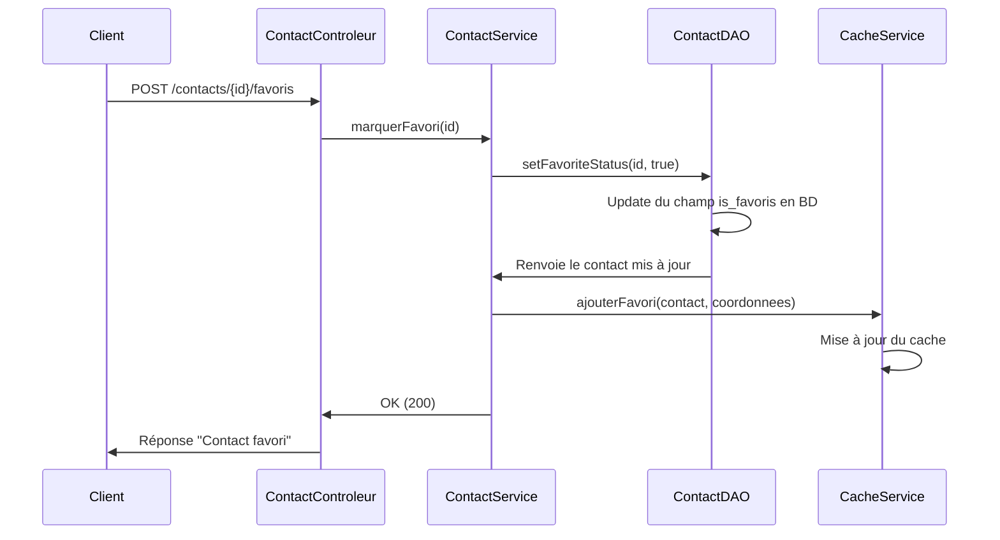
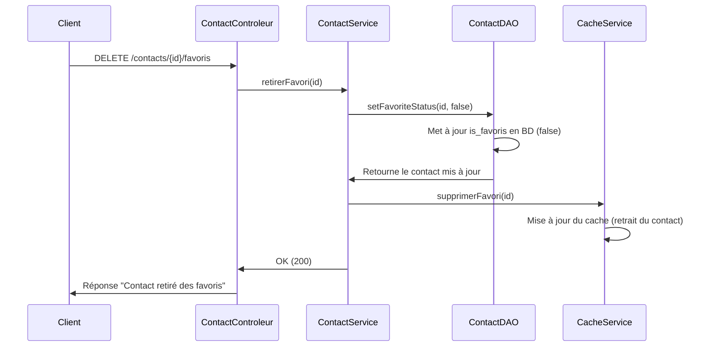

# TP-JAVA-FINAL

# Documentation du projet "mes_chums"

## Présentation de l'Application

L'application "mes_chums" est un service qui permet de gérer une liste de contacts et leurs adresses, d'identifier certains contacts comme favoris, ainsi que de rechercher des contacts favoris situés à proximité d'une ville donnée (basé sur un rayon kilométrique). Elle offre une interface REST simple permettant d'ajouter des contacts, d'ajouter des adresses, de marquer des contacts comme favoris et de rechercher les favoris proches d'une certaine localisation.

### Fonctionnalités principales

- **Gestion de contacts** : Ajouter, consulter et lister tous les contacts.
- **Ajout d'adresses** : Associer des adresses à un contact existant.
- **Gestion des favoris** : Marquer certains contacts comme favoris, les retirer de la liste des favoris.
- **Recherche par proximité** : Rechercher parmi les favoris, ceux qui se trouvent dans un certain rayon autour d'une ville spécifiée.
- **Mécanisme de cache** : Les données concernant les favoris sont mises en cache pour optimiser les performances, notamment lors des recherches par proximité.

### Technologies utilisées

- **Langage de programmation** : Java
- **Gestionnaire de projet et dépendances** : Maven (fichier `pom.xml`)
- **Serveur HTTP** : Utilisation d'un serveur `HttpServer` intégré à Java (`com.sun.net.httpserver.HttpServer`).
- **Base de données** : SQLite (fichier `data.db` dans `src/main/resources`).
- **API de Géocodage** : OpenWeatherMap Geocoding API (pour obtenir les coordonnées latitude/longitude à partir d'une ville).

## Concepts Clés du Projet

### 1. Endpoints REST

L'application expose plusieurs endpoints via un serveur HTTP sur le port `8080`.

- `GET /contacts`  
  Retourne la liste de tous les contacts.
    - **Exemple de requête** : `GET http://localhost:8080/contacts`
    - **Exemple de réponse (JSON)** :
      ```json
      [
        {
          "nom": "Dupont",
          "prenom": "Jean",
          "favoris": true,
          "adresses": [
            {
              "rue": "10 Rue de Paris",
              "ville": "Paris",
              "codePostal": "75000",
              "pays": "France",
              "coordonnees": { "latitude": 48.8566, "longitude": 2.3522, "id_coordonnees": null }
            }
          ]
        },
        ...
      ]
      ```


- `GET /contacts/{id}`


Retourne un contact spécifique par son ID.

**Exemple de requête** :
 `GET http://localhost:8080/contacts/1`


**Exemple de réponse (JSON)** :
```json
{
  "nom": "Dupont",
  "prenom": "Jean",
  "favoris": true,
  "adresses": [
    {
      "rue": "10 Rue de Paris",
      "ville": "Paris",
      "codePostal": "75000",
      "pays": "France",
      "coordonnees": { "latitude": 48.8566, "longitude": 2.3522, "id_coordonnees": null }
    }
  ]
}
```

- `GET /contacts/favoris`  
  Retourne la liste des contacts marqués comme favoris.
    - **Exemple de requête** : `GET http://localhost:8080/contacts/favoris`
    - **Exemple de réponse (JSON)** :
      ```json
      [
        {
          "nom": "Dupont",
          "prenom": "Jean",
          "favoris": true,
          "adresses": [
            {
              "rue": "10 Rue de Paris",
              "ville": "Paris",
              "codePostal": "75000",
              "pays": "France",
              "coordonnees": { "latitude": 48.8566, "longitude": 2.3522, "id_coordonnees": null }
            }
          ]
        },
        {
          "nom": "Mokhtar",
          "prenom": "Moussa",
          "favoris": true,
          "adresses": [
            {
              "rue": "40 Rue de Montreal",
              "ville": "Montreal",
              "codePostal": "H1A 0A1",
              "pays": "Canada",
              "coordonnees": { "latitude": 45.5017, "longitude": 73.5673, "id_coordonnees": null }
            }
          ]
        }
      ]
      ```

- `GET /contacts/proximite?ville={ville}&rayon={rayon}`  
  Recherche parmi les favoris ceux qui se trouvent à l'intérieur d'un rayon spécifié (en km) autour de la ville donnée.
    - **Exemple de requête** : `GET http://localhost:8080/contacts/proximite?ville=Paris&rayon=50`
    - **Exemple de réponse (JSON)** :
      ```json
      [
        {
          "nom": "Dupont",
          "prenom": "Jean",
          "favoris": true,
          "adresses": [
            {
              "rue": "10 Rue de Paris",
              "ville": "Paris",
              "codePostal": "75000",
              "pays": "France",
              "coordonnees": { "latitude": 48.8566, "longitude": 2.3522, "id_coordonnees": null }
            }
          ]
        }
      ]
      ```


- `POST /contacts`  
  Ajoute un nouveau contact.
    - **Exemple de requête** : `POST http://localhost:8080/contacts`
      - **Corps JSON requis** :
        ```json
        {
          "nom": "Doe",
          "prenom": "John",
          "favoris": false,
          "adresses": [
            {
              "rue": "123 Main Street",
              "ville": "Montreal",
              "codePostal": "H1A 0A1",
              "pays": "Canada"
            }
          ]
        }
        ```
        OU
        ```json
        {
          "nom": "Doe",
          "prenom": "John",
          "favoris": false,
          "adresses": null
        }
        ```
          - **Exemple de réponse (JSON)** `201 Created`:
        ```json
        {
          "nom": "Doe",
          "prenom": "John",
          "favoris": false,
          "adresses": []
         }
        ```
    


- `POST /contacts/{id}/adresses`  
  Ajoute une nouvelle adresse à un contact existant.
    - **Exemple de requête** : `POST http://localhost:8080/contacts/3/adresses`
        - **Corps JSON requis** :
          ```json
          {
            "rue": "55 Rue Royale",
            "ville": "Lyon",
            "codePostal": "69000",
            "pays": "France"
          }
          ```
        - **Exemple de réponse (text/plain)** `201 Created`:
          ```text
          Adresse ajoutée avec succès au contact ID 3
          ```

- `POST /contacts/{id}/favoris`  
  Marque un contact comme favori.
    - **Exemple de requête** : `POST http://localhost:8080/contacts/3/favoris`
        - **Exemple de réponse (text/plain)** `200 OK`:
          ```text
          Contact ID 3 marqué comme favori.
          ```

- `DELETE /contacts/{id}/favoris`  
  Retire un contact des favoris.
    - **Exemple de requête** : `DELETE http://localhost:8080/contacts/3/favoris`
        - **Exemple de réponse (text/plain)** `200 OK`:
          ```text
          Contact ID 3 retiré des favoris.
          ```


### Architecture Logicielle

L’architecture de l’application est basée sur une séparation claire des responsabilités au sein de différentes couches. Cette approche facilite la maintenabilité, la testabilité et l’évolutivité du projet. Voici les différentes couches et leurs rôles :

1. **Couche Contrôleur (Controller)**  
   **Rôle** : La couche contrôleur est chargée de recevoir les requêtes HTTP provenant du client (par exemple un navigateur ou un outil comme `curl`), d’extraire les informations nécessaires de la requête (paramètres d’URL, corps JSON, etc.) et de retourner une réponse appropriée (JSON, texte, etc.).

   Dans le projet, le contrôleur principal est implémenté dans la classe `ContactControleur.java`.

   *Exemple* :
   ```java
   @Override
   public void handle(HttpExchange exchange) throws IOException {
       String method = exchange.getRequestMethod();
       String path = exchange.getRequestURI().getPath();

       if (method.equalsIgnoreCase("GET") && path.equals("/contacts")) {
           // Appeler le service pour obtenir la liste des contacts
           listerContacts(exchange);
       }
       // ...
   }
    ```
   Le contrôleur ne contient pas de logique métier ni d’accès direct aux données. Il délègue ces responsabilités à la couche Service.

   **Importance** : Cette couche agit comme une "porte d’entrée" contrôlée vers l’application. Elle permet de valider les entrées et de formater les sorties, assurant ainsi une interface propre et stable.


2. **Couche Service (Service)**
   **Rôle** : La couche service contient toute la logique métier. Elle orchestre les opérations, applique les règles métier, vérifie les conditions et enchaîne les appels aux différentes couches (DAO, mapper, cache, services externes).

    Dans le projet, la classe `ContactService.java` illustre cette logique.
    
    **Exemple** :
    
    ```java
    public ContactDTO ajouterContact(ContactDTO dtoContact) throws IOException, SQLException {
        Contact contact = contactMapper.dtoToContactBasic(dtoContact);
        Contact contactAjoute = contactDAO.ajouter(contact);
    
        // Gestion des adresses, coordonnées et favoris...
    
        return contactMapper.contactToDto(contactAjoute);
    }   
    ```
   **Importance :** Cette couche est le cœur du système, car elle garantit que la logique métier est centralisée et cohérente. Elle facilite également les tests et la maintenance en isolant les règles métier du reste de l’infrastructure.


3. **Couche DAO (Data Access Object)**

    **Rôle** : Les DAOs sont responsables de l’interaction avec la base de données. Ils exécutent des requêtes SQL (SELECT, INSERT, UPDATE, DELETE) et renvoient les résultats sous forme d’entités du domaine.
    
    Dans le projet, `ContactDAO.java` et `CoordonneesDAO.java` gèrent l’accès aux données.
    
    **Exemple** :
    
    ```java
    public List<Contact> listerTousLesContacts() {
        List<Contact> contacts = new ArrayList<>();
        String query = "SELECT * FROM contact";
    
        try (Connection conn = obtenirConnexion();
             Statement stmt = conn.createStatement();
             ResultSet rs = stmt.executeQuery(query)) {
    
            while (rs.next()) {
                Contact contact = new Contact();
                contact.setId_contact(rs.getInt("id_contact"));
                contact.setNom(rs.getString("nom"));
                contact.setPrenom(rs.getString("prenom"));
                contact.setFavoris(rs.getBoolean("is_favoris"));
    
                List<Adresse> adresses = loadAdressesForContact(contact.getId_contact());
                contact.setAdresses(adresses);
    
                contacts.add(contact);
            }
    
        } catch (SQLException e) {
            e.printStackTrace();
        }
    
        return contacts;
    }
    ```
   **Importance :** En isolant l’accès aux données dans le DAO, on rend le code plus flexible et plus simple à modifier en cas de changement de base de données ou de schéma. Les autres couches n’ont pas à connaître les détails de stockage.


4. **Couche Modèle (Model)**

    **Rôle** : Le modèle regroupe les classes représentant les entités du domaine (Contact, Adresse, Coordonnees). Ces classes sont des "containers" de données, avec des méthodes utilitaires ou de validation élémentaire.
    
    **Exemple** :
    
    ```java
    public class Contact {
        private Integer id_contact;
        private String nom;
        private String prenom;
        private boolean favoris;
        private List<Adresse> adresses;
    
        // Getters, setters, equals, hashCode...
    }
    ```
    **Importance :** Le modèle sert de langage commun aux différentes couches. Les entités du domaine sont au cœur de l’application, représentant les données manipulées par les services.


5. **Couche Mapper et DTO (Data Transfer Objects)**

    **Rôle** : Le mapper (`ContactMapper.java`) transforme les entités du domaine en DTO, et inversement. Les DTO sont utilisés pour exposer les données aux clients (par exemple sous forme JSON) sans révéler la structure interne des entités. Cela facilite l’évolution interne du code sans affecter l’interface publique.

    **Exemple** :

    ```java
    public ContactDTO contactToDto(Contact contact) {
            ContactDTO dto = new ContactDTO();
            dto.setNom(contact.getNom());
            dto.setPrenom(contact.getPrenom());
            dto.setFavoris(contact.isFavoris());
            // Conversion des adresses en AdresseDTO...
            return dto;
    }
    ```
    **Importance :** Cette couche assure une séparation nette entre la logique interne de l’application et les données exposées aux clients. Elle permet de faire évoluer l’application en interne sans casser l’interface publique.


### 3. Mécanisme de Cache

Le système de cache stocke les informations concernant les **contacts favoris** ainsi que leurs coordonnées. Lorsqu'un contact est marqué comme favori :

- Le `ContactService` met à jour la base de données (via `ContactDAO`) pour indiquer que ce contact est favori.
- Le `ContactService` met à jour le `CacheService` pour y ajouter le contact et ses coordonnées.

Inversement, lorsque le contact n'est plus favori :

- Mise à jour dans la base de données (le contact n'est plus favori).
- Suppression du contact du `CacheService`.

**Diagramme de séquence simplifié pour marquer un contact comme favori** :



**Diagramme de séquence simplifié pour retirer un contact des favoris** :



### 4. Utilisation de la Géolocalisation

Dans ce projet, nous utilisons l'API de géocodage d'OpenWeatherMap afin d'obtenir les coordonnées GPS (latitude et longitude) à partir d'une ville spécifiée. Ces coordonnées sont ensuite utilisées pour :
- Insérer les adresses dans la base de données avec des données géographiques complètes.
- Effectuer des recherches de proximité entre une ville donnée et les contacts favoris stockés en cache.

**Fonctionnement général** :
1. Lors de l'ajout d'un contact ou de l'ajout d'une adresse, le service (`ContactService`) extrait le nom de la ville.
2. Une requête HTTP est envoyée à l'API OpenWeatherMap pour obtenir la latitude et la longitude de cette ville.
3. Si les coordonnées sont trouvées, elles sont stockées en base de données et associées à l'adresse du contact.
4. Ces informations sont ensuite utilisées lors de la recherche à proximité, en calculant la distance entre la ville de référence et les coordonnées des adresses des contacts favoris.

**Exemple de code depuis `OpenWeatherMapService.java`** :

```java
public double[] getCoordoneByCity(String city) {
    double[] coordinates = new double[2]; // Index 0: latitude, Index 1: longitude
    try {
        // Construction de l'URL de la requête : on cherche une correspondance pour la ville spécifiée
        String urlStr = BASE_URL + "direct?q=" + city + "&limit=1&appid=" + API_KEY;
        URL url = new URL(urlStr);
        
        // Ouverture de la connexion HTTP
        HttpURLConnection conn = (HttpURLConnection) url.openConnection();
        conn.setRequestMethod("GET");

        int responseCode = conn.getResponseCode();
        if (responseCode == HttpURLConnection.HTTP_OK) {
            // Lecture du flux de réponse
            BufferedReader in = new BufferedReader(new InputStreamReader(conn.getInputStream()));
            StringBuilder response = new StringBuilder();
            String inputLine;
            while ((inputLine = in.readLine()) != null) {
                response.append(inputLine);
            }
            in.close();

            // Utilisation de Jackson pour parser la réponse JSON
            ObjectMapper mapper = new ObjectMapper();
            JsonNode rootNode = mapper.readTree(response.toString());

            // Si le tableau retourné par l'API n'est pas vide, on récupère la première entrée
            if (rootNode.isArray() && rootNode.size() > 0) {
                JsonNode firstNode = rootNode.get(0);
                double lat = firstNode.get("lat").asDouble();
                double lon = firstNode.get("lon").asDouble();
                coordinates[0] = lat;
                coordinates[1] = lon;
            } else {
                System.out.println("Aucune donnée trouvée pour la ville : " + city);
            }
        } else {
            System.out.println("Échec de la requête : code " + responseCode);
        }
    } catch (Exception e) {
        e.printStackTrace();
    }
    return coordinates;
}

```

**Commentaire du code :**

- **BASE_URL et API_KEY** : valeurs définies en tant que constantes, l'API_KEY provenant d'un compte OpenWeatherMap.
- **conn.setRequestMethod("GET")** : envoi d'une requête GET à l'API.
- **Lecture de la réponse** à l'aide d'un `BufferedReader`.
- **Utilisation du `ObjectMapper` (Jackson)** pour parser la réponse JSON.
- **Extraction des champs `lat` et `lon`** dans le résultat.


**Intégration dans la logique métier (ContactService) :**

Lorsque le `ContactService` reçoit un `ContactDTO` ou un `AdresseDTO`, il extrait la ville, appelle `weatherService.getCoordoneByCity(ville)` et obtient ainsi les coordonnées. Par exemple, lors de l'ajout d'une nouvelle adresse :


```java
public void ajouterAdresse(int contactId, AdresseDTO adresseDTO) throws IOException, SQLException {
    String ville = adresseDTO.getVille();
    double[] coordonneesArray = weatherService.getCoordoneByCity(ville);

    if (coordonneesArray[0] == 0 && coordonneesArray[1] == 0) {
        throw new IOException("Coordonnées introuvables pour la ville : " + ville);
    }

    // Création de l'entité Coordonnees
    Coordonnees coordonnees = new Coordonnees(coordonneesArray[0], coordonneesArray[1]);
    adresseDTO.setCoordonnees(coordonnees);

    // Conversion du DTO en entité Adresse et insertion via le DAO
    Adresse adresse = contactMapper.dtoToAdresse(adresseDTO);
    contactDAO.ajouterAdresse(contactId, adresse);
}
```
Dans ce bloc de code, on :

- Récupère le nom de la ville depuis le DTO.
- Appelle le service météo (`weatherService`) pour obtenir les coordonnées.
- Vérifie si les coordonnées sont valides.
- Met à jour l'`AdresseDTO` avec les coordonnées obtenues.
- Convertit le DTO en entité `Adresse` à l’aide du mapper, puis insère l’adresse en base via le `ContactDAO`.

Avant de stocker l'adresse, ces coordonnées sont insérées dans la base de données et reliées à l'adresse. Ainsi, lorsqu'on fait une recherche de proximité, on utilise ces coordonnées pour calculer les distances entre la ville de référence et les coordonnées stockées.


### 5. Injection de Dépendances

Dans le projet, l’injection de dépendances est mise en place de manière manuelle, sans framework dédié, mais avec une approche claire qui favorise la flexibilité et la maintenabilité.

**Principe** :  
Au lieu que les classes créent elles-mêmes leurs dépendances (par exemple, un `ContactService` qui instancierait directement un `ContactDAO` ou un `CacheService`), ces dépendances sont injectées via le constructeur. Cela permet de remplacer facilement une dépendance par une autre implémentation sans modifier le code métier. Par exemple, lors des tests, on peut injecter un DAO factice (mock) au lieu d'utiliser l'accès réel à la base de données.

- Le `ContactService` reçoit des instances de `ContactDAO`, `CacheService`, `OpenWeatherMapService` et `ContactMapper` dans son constructeur. Cette approche favorise l'adaptabilité (on peut remplacer un service par un mock en test) et la séparation des préoccupations.


**Exemple d’injection dans la classe Main** :  
Dans la méthode `main` (point d’entrée de l’application), on crée explicitement les différentes instances, puis on les injecte dans les services et contrôleurs.

```java
public class Main {
    public static void main(String[] args) throws IOException {
        // Instanciation des dépendances
        ContactDAO contactDAO = new ContactDAO();
        CoordonneesDAO coordonneesDAO = new CoordonneesDAO(contactDAO);
        CacheService cacheService = new CacheService(coordonneesDAO);
        ContactMapper contactMapper = new ContactMapper();
        OpenWeatherMapService weatherService = new OpenWeatherMapService();

        // Injection des dépendances dans ContactService
        ContactService contactService = new ContactService(contactDAO, cacheService, weatherService, contactMapper);

        // Le contrôleur reçoit également ses dépendances via son constructeur
        HttpServer server = HttpServer.create(new InetSocketAddress(8080), 0);
        server.createContext("/contacts", new ContactControleur(contactService));
        server.start();
        
        System.out.println("Serveur démarré avec succès sur le port 8080 !");
    }
}
```

